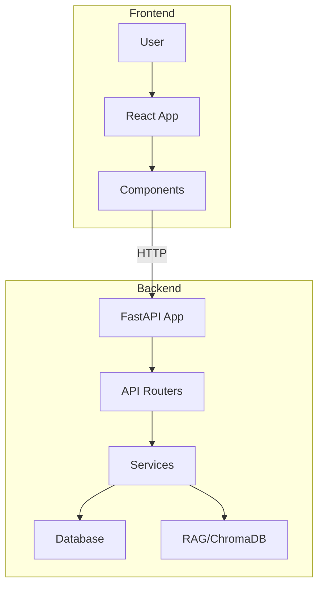

# Project Architecture

## Overview

This project is a full-stack application with a Python-based backend (FastAPI) and a modern JavaScript frontend (likely React, based on `.tsx` files). The backend provides RESTful APIs, authentication, database management, and RAG (Retrieval-Augmented Generation) services. The frontend offers a user interface for chat, authentication, and data visualization. The system is designed for modularity, scalability, and ease of extension.

---

## Backend Architecture

**Location:** `backend/`

### 1. API Layer
- **Path:** `backend/app/api/v1/`
- **Files:** `admin.py`, `auth.py`, `chat.py`, `preview.py`
- **Purpose:**
  - Exposes RESTful endpoints for admin, authentication, chat, and preview functionalities.
  - Each file typically defines a FastAPI router for a specific domain.

### 2. Core Configuration
- **Path:** `backend/app/core/config.py`
- **Purpose:**
  - Centralizes application configuration (environment variables, settings, etc.).

### 3. Database Layer
- **Path:** `backend/app/db/`
- **Files:** `models.py`, `check_current_schema.py`, `migrations/`
- **Purpose:**
  - `models.py`: SQLAlchemy ORM models for database tables.
  - `check_current_schema.py`: Ensures DB schema consistency.
  - `migrations/`: Alembic migration scripts for schema evolution.

### 4. Services Layer
- **Path:** `backend/app/services/`
- **Files:** `analytics.py`, `auth.py`, `rag.py`
- **Purpose:**
  - Implements business logic for analytics, authentication, and RAG (Retrieval-Augmented Generation).
  - Decouples core logic from API layer for maintainability.

### 5. RAG (Retrieval-Augmented Generation)
- **Path:** `backend/rag/`
- **Files:** `build_index.py`, `embedder.py`, `loaders.py`, `chroma_db/`, `html/`
- **Purpose:**
  - Handles document ingestion, embedding, indexing, and retrieval for RAG workflows.
  - `chroma_db/`: Vector store and related files for fast similarity search.
  - `html/`: Source documents for ingestion.

### 6. Application Entry Point
- **Path:** `backend/app/main.py`
- **Purpose:**
  - FastAPI app instantiation and router inclusion.
  - Application startup and shutdown events.

### 7. Migrations
- **Path:** `backend/migrations/`
- **Purpose:**
  - Alembic environment and migration scripts for database schema management.

---

## Frontend Architecture

**Location:** `frontend/`

### 1. Entry Point
- **Files:** `index.html`, `main.tsx`
- **Purpose:**
  - Bootstraps the React application.

### 2. Main Application
- **File:** `App.tsx`
- **Purpose:**
  - Root React component, sets up routing and global state.

### 3. Components
- **Path:** `frontend/src/components/`
- **Files:**
  - `Chat.tsx`: Chat interface.
  - `Login.tsx`: User authentication UI.
  - `MarkdownRenderer.tsx`: Renders markdown content.
  - `MessageList.tsx`: Displays chat messages.
  - `SessionSidebar.tsx`: Sidebar for session management.
  - `SourceModal.tsx`: Modal for displaying document sources.

### 4. API Integration
- **File:** `frontend/src/api.ts`
- **Purpose:**
  - Handles HTTP requests to backend endpoints (authentication, chat, etc.).

### 5. Styling & Configuration
- **Files:** `index.css`, `vite.config.ts`, `tsconfig*.json`
- **Purpose:**
  - Application styling and build configuration.

---

## Data Flow & Integration

1. **User interacts with frontend** (e.g., logs in, sends chat message).
2. **Frontend calls backend API** via `api.ts` using HTTP (likely REST endpoints).
3. **Backend processes request**:
   - Authenticates user (via `services/auth.py` and `api/v1/auth.py`).
   - Handles chat or data requests (via `services/rag.py`, `api/v1/chat.py`).
   - Retrieves or stores data in the database (via `db/models.py`).
   - For RAG, retrieves relevant documents from `chroma_db/` and returns results.
4. **Backend responds** with data or error.
5. **Frontend updates UI** based on response.

---

## Deployment & DevOps

- **Docker:**
  - (Dockerfiles and `docker-compose.yml` are present but currently deleted; likely used for containerized deployment of backend and frontend.)
- **Scripts:**
  - `scripts/refresh_nhs_data.sh`: Refreshes NHS data for ingestion.
  - `scripts/register_user.sh`: Registers a new user (likely via backend API).
- **Database:**
  - SQLite (`dev.db`) for development; can be swapped for production DB.
- **Migrations:**
  - Managed via Alembic (`backend/migrations/`).

---

## Extensibility & Testing

- **Extensibility:**
  - Modular backend (API, services, RAG) allows for easy addition of new endpoints or business logic.
  - Frontend component structure supports new features and UI elements.
- **Testing:**
  - `backend/tests/` directory reserved for backend tests (add unit/integration tests here).
  - Frontend can use standard React testing tools (Jest, React Testing Library).

---

## Summary Diagram

---

## Notes
- For more details, see code in respective directories.
- Update this document as the architecture evolves.
