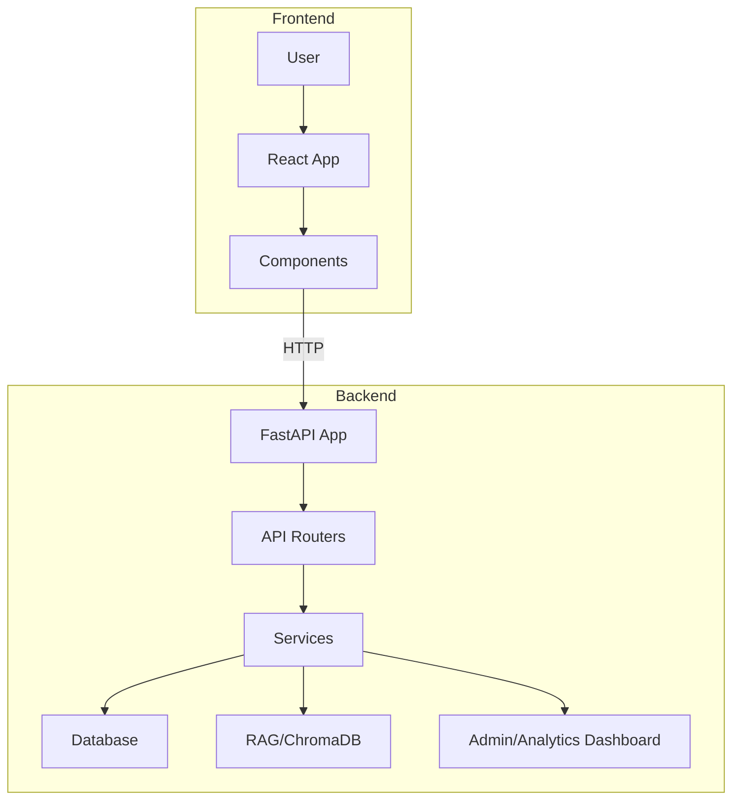

# Project Architecture

## Overview

This project is a full-stack application with a Python-based backend (FastAPI) and a modern JavaScript frontend (React). The backend provides RESTful APIs, authentication, database management, analytics, and RAG (Retrieval-Augmented Generation) services. The frontend offers a user interface for chat, authentication, session management, and data visualization. The system is designed for modularity, scalability, and ease of extension.

---

## Backend Architecture

**Location:** `backend/`

### 1. API Layer
- **Path:** `backend/app/api/v1/`
- **Files:** `admin.py`, `auth.py`, `chat.py`, `preview.py`
- **Purpose:**
  - Exposes RESTful endpoints for admin, authentication, chat, preview, and analytics functionalities.
  - Each file defines a FastAPI router for a specific domain.
  - **Key Endpoints:**
    - `/auth/login`, `/auth/register`, `/auth/me`: User authentication and registration (with extended user profile fields and consent).
    - `/chat`, `/chat/sessions`, `/chat/session/{id}`: Chat with session management, message history, and deletion.
    - `/admin/analytics`: Analytics data for admin dashboard (with filters for demographics, RAG score, etc.).
    - `/preview/link-preview`: Rich link/document preview for sources.

### 2. Core Configuration
- **Path:** `backend/app/core/config.py`
- **Purpose:**
  - Centralizes application configuration (environment variables, settings, etc.).

### 3. Database Layer
- **Path:** `backend/app/db/`
- **Files:** `models.py`, `check_current_schema.py`, `migrations/`
- **Purpose:**
  - `models.py`: SQLAlchemy ORM models for users (with admin flag, consent, demographics), chat sessions, messages (with sources, confidence score), and unanswered queries (with reason, score, sources).
  - `check_current_schema.py`: Ensures DB schema consistency.
  - `migrations/`: Alembic migration scripts for schema evolution.

### 4. Services Layer
- **Path:** `backend/app/services/`
- **Files:** `analytics_dashboard.py`, `auth.py`, `rag.py`
- **Purpose:**
  - `auth.py`: Implements authentication, password hashing, JWT, and admin detection.
  - `rag.py`: Implements hybrid RAG (Retrieval-Augmented Generation) with GPT-4o, NHS/Cancer Research vector search, and fallback to general medical knowledge. Handles context-aware queries, source extraction, and response formatting.
  - `analytics_dashboard.py`: Streamlit-based admin dashboard for visualizing answered/unanswered questions, demographics, and RAG performance (admin login required).

### 5. RAG (Retrieval-Augmented Generation)
- **Path:** `backend/rag/`
- **Files:** `build_index.py`, `embedder.py`, `loaders.py`, `chroma_db/`, `html/`
- **Purpose:**
  - Handles document ingestion, embedding, indexing, and retrieval for RAG workflows.
  - `chroma_db/`: Vector store and related files for fast similarity search (NHS, Cancer Research UK, etc.).
  - `html/`: Source documents for ingestion.

### 6. Application Entry Point
- **Path:** `backend/app/main.py`
- **Purpose:**
  - FastAPI app instantiation and router inclusion.
  - Application startup and shutdown events.
  - CORS configuration for frontend integration.

### 7. Migrations
- **Path:** `backend/migrations/`
- **Purpose:**
  - Alembic environment and migration scripts for database schema management.

### 8. Scripts
- **Path:** `scripts/`
- **Files:**
  - `register_user.sh`: Registers a new user via backend API. Usage: `./scripts/register_user.sh [email] [password] [api_base]`. Returns access token on success.
  - `make_user_admin.py`: Promotes a user to admin by email. Usage: `python make_user_admin.py user@example.com`.
  - `refresh_nhs_data.sh`: (Reserved for future use) Intended to refresh NHS data for ingestion.

---

## Frontend Architecture

**Location:** `frontend/`

### 1. Entry Point
- **Files:** `index.html`, `main.tsx`
- **Purpose:**
  - Bootstraps the React application.

### 2. Main Application
- **File:** `App.tsx`
- **Purpose:**
  - Root React component, sets up authentication, routing, and global state.
  - Handles JWT token management and axios configuration.

### 3. Components
- **Path:** `frontend/src/components/`
- **Files:**
  - `Chat.tsx`: Chat interface with session management, message history, and RAG/source display.
  - `Login.tsx`: User authentication and registration UI (with extended profile fields and consent).
  - `SessionSidebar.tsx`: Sidebar for managing chat sessions (view, select, delete, start new).
  - `MessageList.tsx`: Displays chat messages, sources, and loading states.
  - `SourceModal.tsx`: Modal for displaying document/source previews (with iframe fallback for blocked sites).
  - `MarkdownRenderer.tsx`: Renders markdown content in chat messages.

### 4. API Integration
- **File:** `frontend/src/api.ts`
- **Purpose:**
  - Handles HTTP requests to backend endpoints (authentication, chat, session management) using axios.
  - Provides `authApi` and `chatApi` for frontend components.

### 5. Styling & Configuration
- **Files:** `index.css`, `vite.config.ts`, `tsconfig*.json`, `eslint.config.js`
- **Purpose:**
  - Application styling, build configuration, and linting.
  - Uses Tailwind CSS for styling.

---

## Data Flow & Integration

1. **User interacts with frontend** (e.g., logs in, registers, sends chat message, manages sessions).
2. **Frontend calls backend API** via `api.ts` using HTTP (REST endpoints).
3. **Backend processes request**:
   - Authenticates user (via `services/auth.py` and `api/v1/auth.py`).
   - Handles chat or data requests (via `services/rag.py`, `api/v1/chat.py`).
   - Retrieves or stores data in the database (via `db/models.py`).
   - For RAG, retrieves relevant documents from `chroma_db/` and returns results with sources.
   - For analytics, aggregates and filters data for admin dashboard.
4. **Backend responds** with data or error.
5. **Frontend updates UI** based on response (chat, session list, analytics, etc.).

---

## Admin & Analytics Dashboard

- **Location:** `backend/app/services/analytics_dashboard.py`
- **Access:** Admin users only (admin flag in user model).
- **Features:**
  - Login with admin credentials (checked via `/auth/me`).
  - Visualize answered/unanswered questions, filter by demographics, RAG score, etc.
  - View and analyze sources, reasons for unanswered queries, and demographic plots.
  - Powered by Streamlit, fetches data from `/api/v1/admin/analytics`.

---

## RAG (Retrieval-Augmented Generation) System

- **Location:** `backend/app/services/rag.py`, `backend/rag/`
- **Features:**
  - Hybrid system combining GPT-4o with vector search over NHS/Cancer Research UK documents.
  - Classifies questions as medical/general, retrieves context, and blends with LLM response.
  - Returns sources and confidence scores; saves unanswered queries for admin review.
  - Fallback to general medical knowledge with source suggestions if no RAG context found.

---

## Extensibility & Testing

- **Extensibility:**
  - Modular backend (API, services, RAG) allows for easy addition of new endpoints or business logic.
  - Frontend component structure supports new features and UI elements.
- **Testing:**
  - `backend/tests/` directory reserved for backend tests (add unit/integration tests here).
  - Frontend can use standard React testing tools (Jest, React Testing Library).

---

## Summary Diagram

---

## Notes
- For more details, see code in respective directories.
- Update this document as the architecture evolves.
